# CFP-32810: Hybrid Routing Mode - Architecture Diagrams

This document contains detailed architecture diagrams for the Hybrid Routing Mode implementation using Mermaid.

## Table of Contents

1. [High-Level System Architecture](#1-high-level-system-architecture)
2. [Component Relationships](#2-component-relationships)
3. [Dynamic Configuration Update Flow](#3-dynamic-configuration-update-flow)
4. [Data Plane Packet Processing](#4-data-plane-packet-processing)
5. [Agent Startup Sequence](#5-agent-startup-sequence)
6. [eBPF Map Reconciliation Flow](#6-ebpf-map-reconciliation-flow)
7. [Subnet Topology Agent State Machine](#7-subnet-topology-agent-state-machine)
8. [Kubernetes Integration](#8-kubernetes-integration)
9. [Class Diagram: Key Components](#9-class-diagram-key-components)
10. [Deployment Architecture](#10-deployment-architecture)

---

## 1. High-Level System Architecture

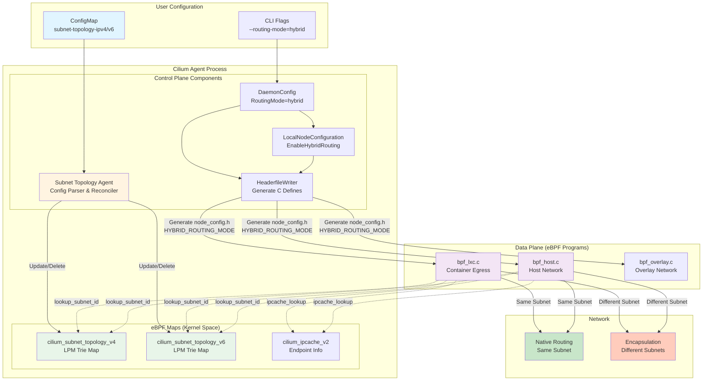

---

## 2. Component Relationships

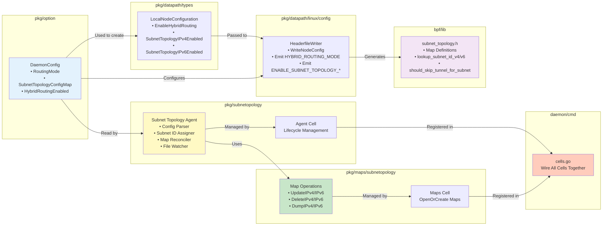

---

## 3. Dynamic Configuration Update Flow

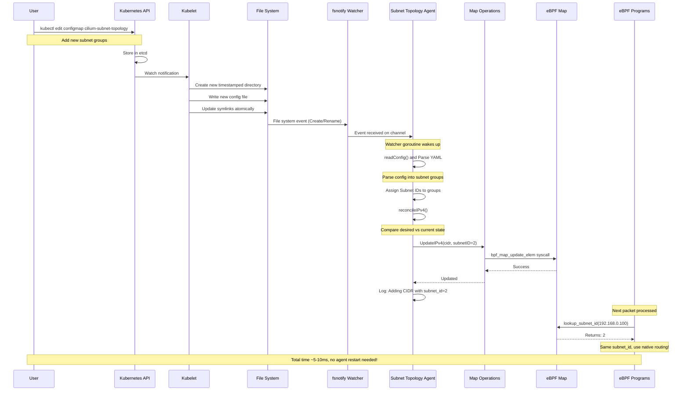

---

## 4. Data Plane Packet Processing

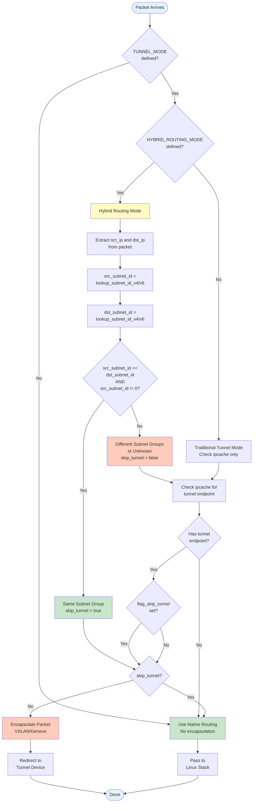

---

## 5. Agent Startup Sequence

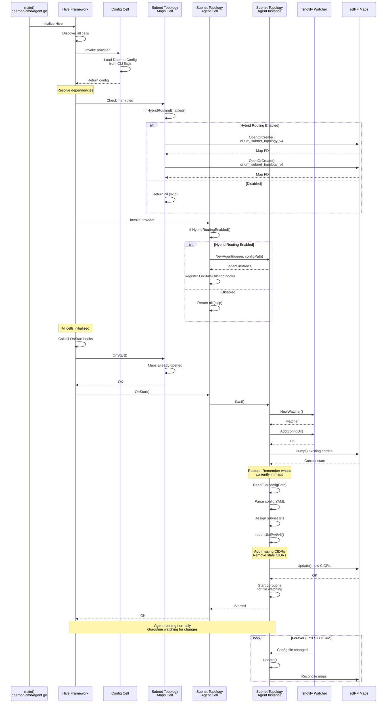

---

## 6. eBPF Map Reconciliation Flow

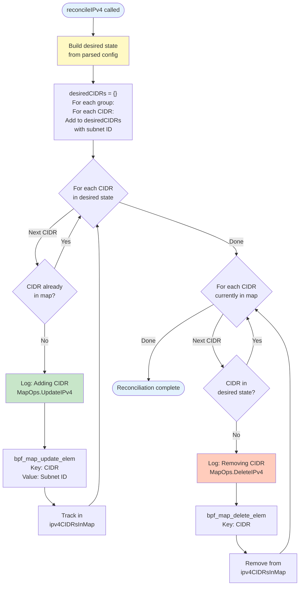

---

## 7. Subnet Topology Agent State Machine

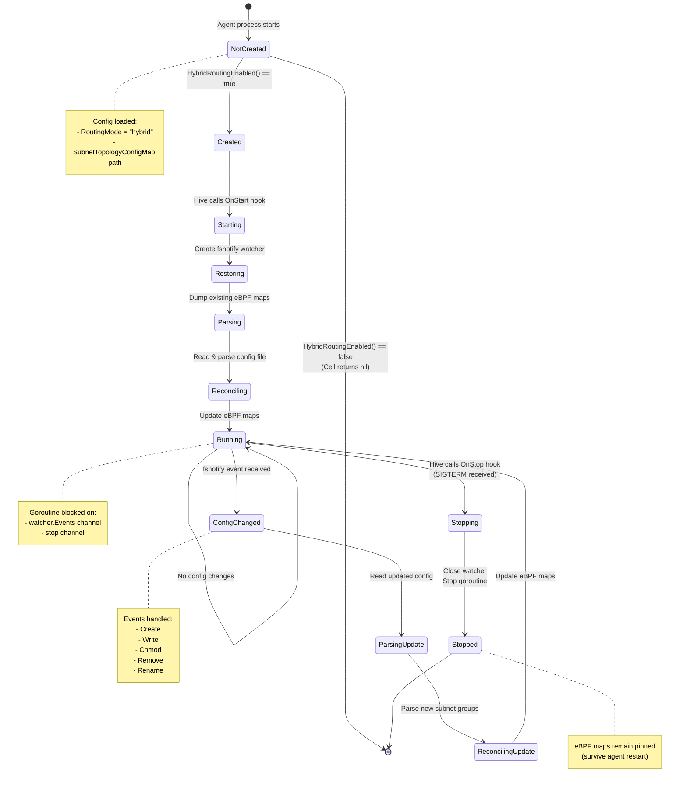

---

## 8. Kubernetes Integration

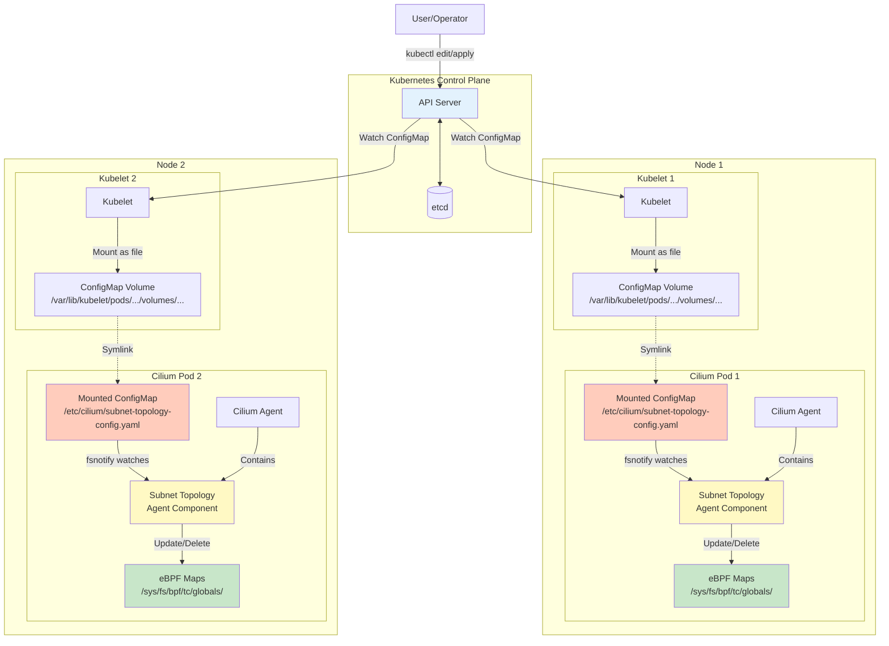

---

## 9. Class Diagram: Key Components

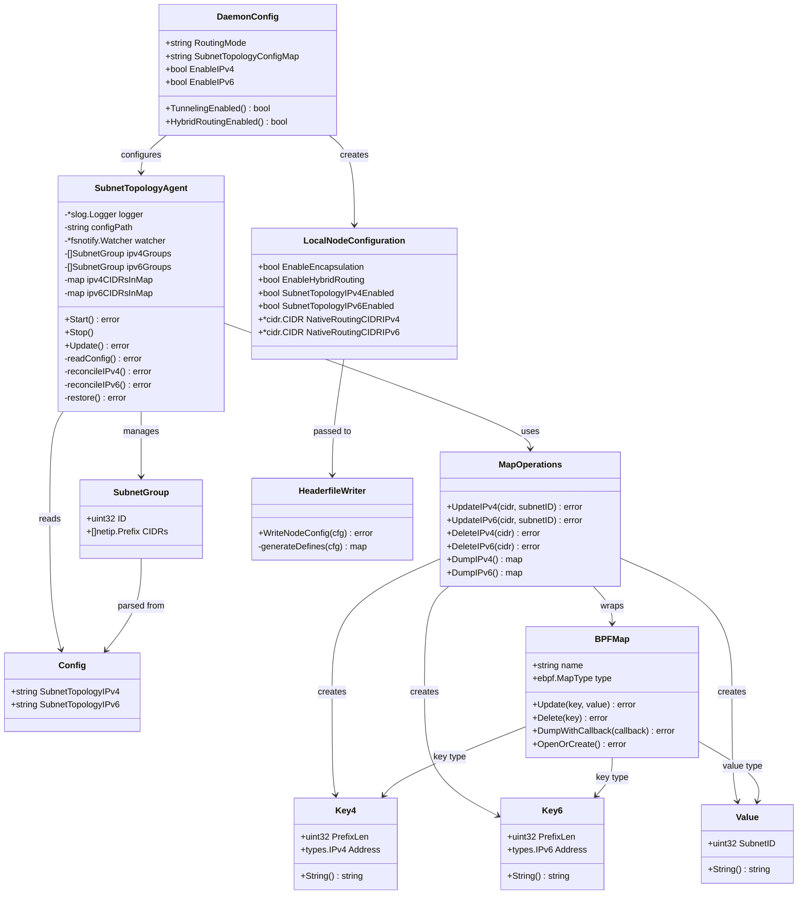

---

## 10. Deployment Architecture

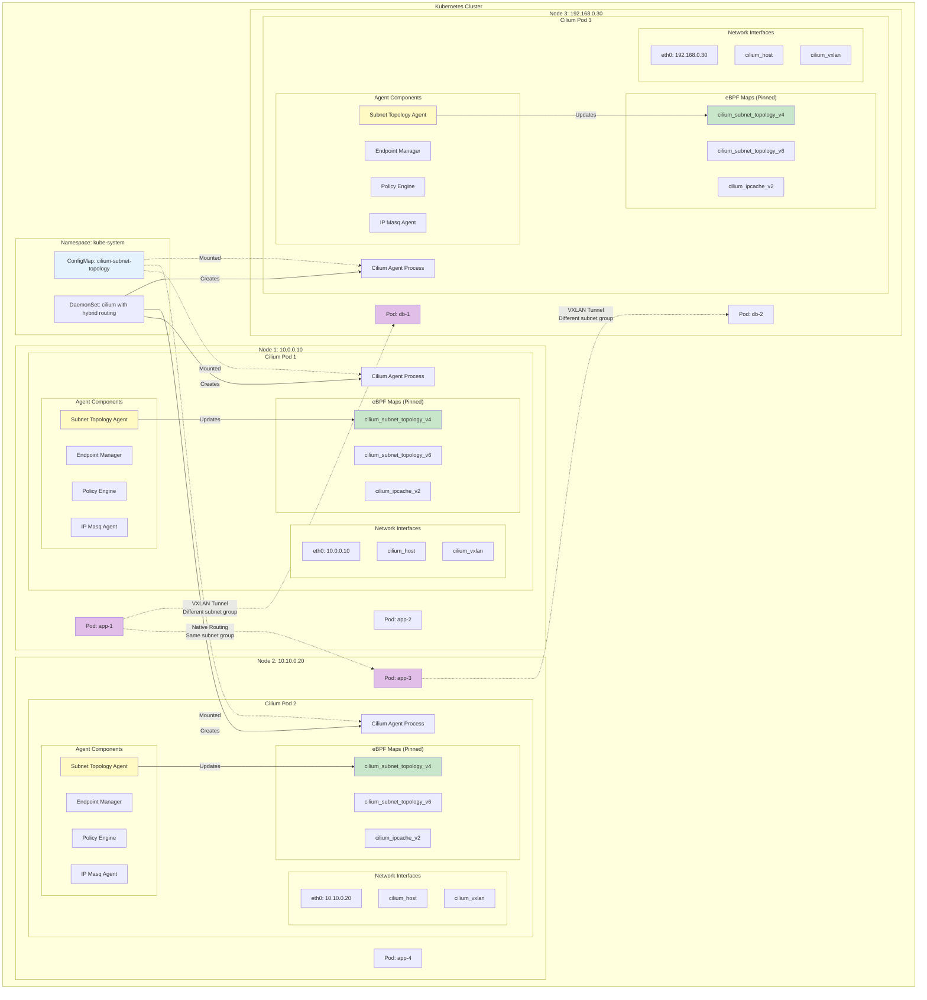

---

## Traffic Flow Examples

### Example 1: Same Subnet Group (Native Routing)

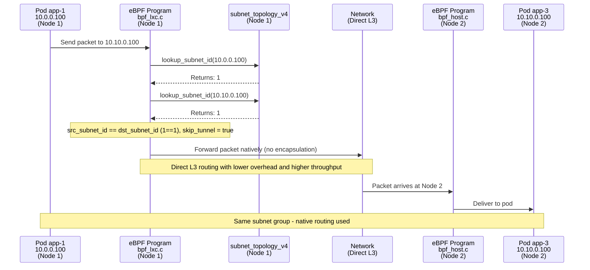

### Example 2: Different Subnet Groups (Encapsulation)

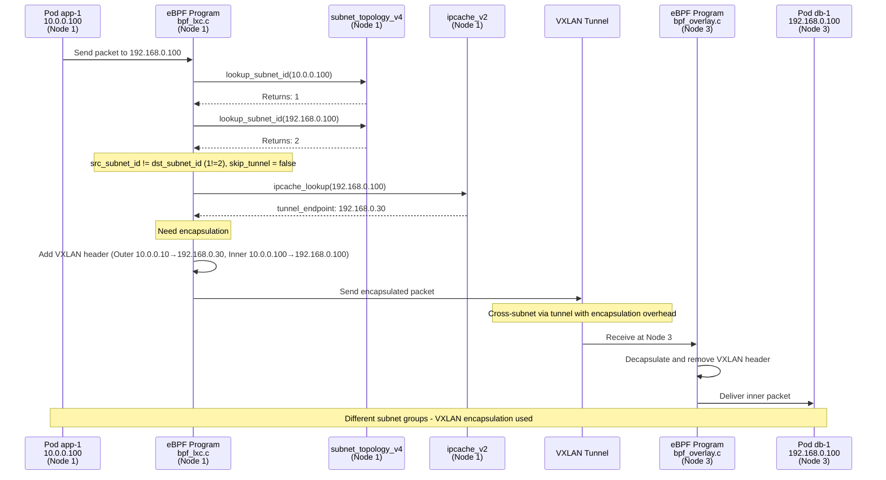

---

## Summary

These diagrams illustrate:

1. **System Architecture**: How all components fit together
2. **Component Relationships**: Dependencies and interactions
3. **Dynamic Updates**: ConfigMap changes → eBPF map updates (no restart!)
4. **Packet Processing**: Routing decision logic in datapath
5. **Startup Sequence**: Hive cell initialization and lifecycle
6. **Reconciliation**: How maps stay in sync with config
7. **State Machine**: Agent lifecycle states
8. **Kubernetes Integration**: How ConfigMaps reach each node
9. **Class Diagram**: Object-oriented view of key types
10. **Deployment**: Multi-node cluster topology

**Key Takeaways**:
- ✅ Subnet Topology Agent runs **inside** Cilium Agent (not separate process)
- ✅ Dynamic updates via **fsnotify + eBPF map syscalls** (no restart)
- ✅ Routing decisions in **datapath** (fast path, per-packet)
- ✅ Configuration in **control plane** (slow path, on-change)
- ✅ Clean separation of concerns with **Hive cells**

---

**Generated**: January 2025
**Related**: CFP-32810 Hybrid Routing Mode Implementation
